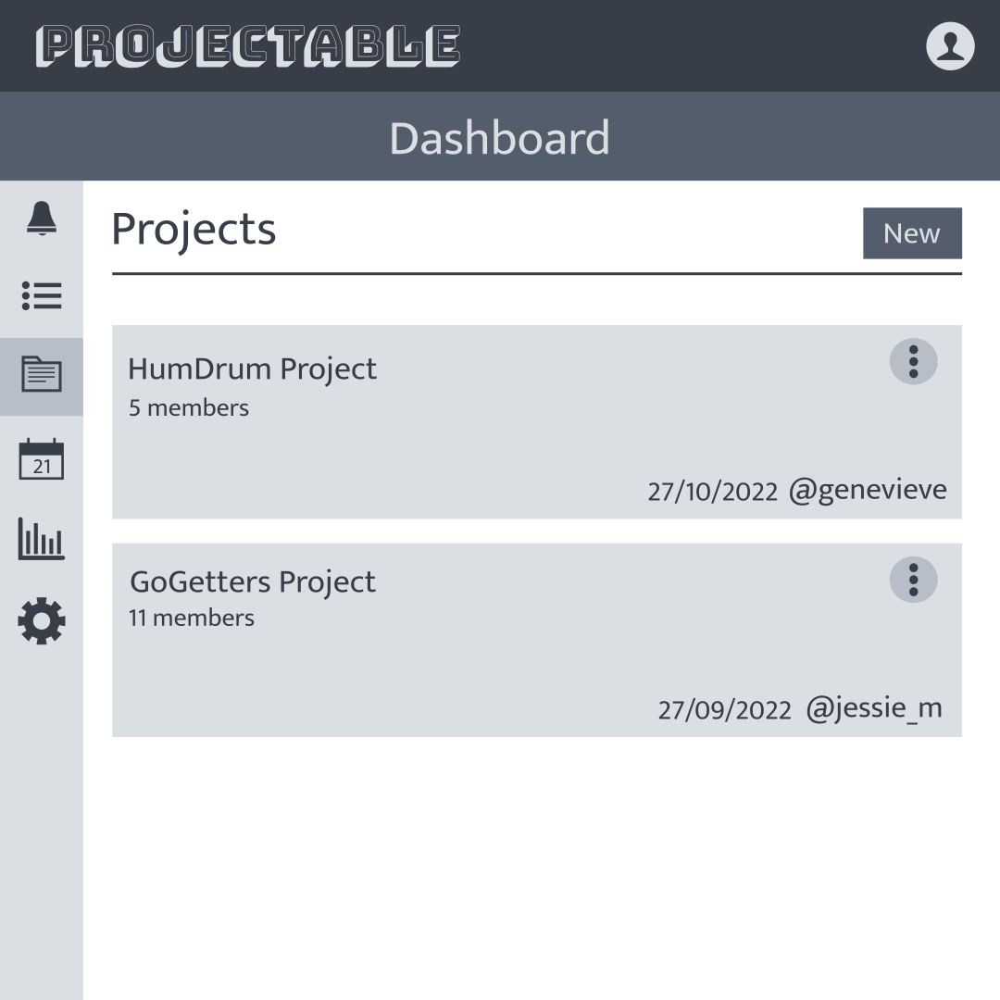

# Projectable

#### Assessment: Full Stack Application - Part A

#### Team: Felix Mckenzie & Robert Neville

## Projectable Description

**Purpose:**

Visual representation is vital when planning a project in a team setting as it conveys high level information to all involved. A Project Manager is responsible for taking a project from ideation to completion, and navigating the team through every step and problem in-between. Many Project Managers are faced with new challenges in today's post-pandemic world, now trying to lead their teams and projects through a completely remote, work-from-home environment. Moreover, it seems remote work is here to stay: 74% of professionals expect remote work to become standard, with 97% not wanting to return to the office full-time (Prossack, 2021). How can teams achieve the same level of success in a distributed workforce?

Task management and communication is central to the success of any Project Manager and team. Projects are made up of dozens of tasks each with their own level of difficulty and time requirements. 77% of high-performing projects use project management software, yet only 22% of organizations actually make the investment (TeamStage, 2020).

While several project management tools exist on the market, many have been met with criticism from users. Existing tools such as Jira are feature rich, however can be complicated to use, with unintuitive workflows and slow load times, and most importantly no dark mode. Simpler alternatives, such as Trello and Asana, provide a lower barrier to entry, however are capped by a paywall once you reach their free tier limit.

Projectable is a lightweight, project management application that helps teams of any size and type collaborate and track the progress of their work. Projectable is a free, open source alternative that puts user experience first.

**Features/Functionality:**

- Register and Login via firebase authentication
- Toggle light and dark mode
- Track progress of tasks and projects on the dashboard home screen.
- A calendar view tracks task due dates
- Create and manage projects
- Create and manage project tasks
- Collaborate by adding team members to projects
- Provide feedback to team members through comments
- Assign tasks to members
- Assign priority to tasks

**Target Audience**

The app is intended for Project Managers, teams and individuals wanting to manage projects of all scales

## Tech Stack

**Frontend**

- React
- Tailwind

**Backend**

- Express
- Node.js
- MongoDB

**Third-Party Services**

- MongoDB Atlas
- Firebase Authentication

## User Stories

As Jenny, A Team Lead, I want a project management application, that allows me to securely register and login with email and password. So only I have access to my projects stored on the application.

As Max, A Project Manager, I’m currently lacking visibility across all my projects. I would like a tool that allows me to plan and manage all of my team’s projects in one place, so that I know how many projects I have, what each includes and when each is happening.

As Joe, A Project Manager, I want to be able to create tasks for a project, So my team can easily visualize all the requirements necessary to complete a project.

As Emma, A Frontend Developer, During a project, plans and requirements often change to meet the client needs, I want to be able to update and delete tasks to reflect the current state of the project.

As Michael, A Frontend Developer on a team, when working on a project I want to be able to view a task’s priority status, so I know what tickets will make the most impact with achieving the project goals.

As Jane, a Backend Developer, I’m often working across multiple projects with multiple teams. I want to receive notifications in a central location, when someone comments on a project task that’s assigned to me.

As Sarah, A Product Manager, When working on a project, I want to be able to track each team member's workload by how many tasks are assigned to an individual, so I can gauge each team member’s work capacity.

As Lisa, A freelance Web Developer, I want to be able to set due dates for projects, so I can manage my workload and stay on track with client requests.

As George, a UX/UI Designer, I want to be able to comment on project tasks that are assigned to fellow team members, so I can know how a task is progressing and provide feedback to the developers on my team.

## Application Architecture Diagram

## Data Flow Diagrams

### The Authentication System

### The Projects Subsystem

### The Tasks SubSystem

### The Task Comments Subsystem

## Wireframes

The Projectable UI has been designed with a desktop first approach. However,
the UI will be responsive to tablet and mobile - using the same layout. With
careful application of a grid based layout and flex content, all UI elements
will resize to fit cleanly in the same format on all device types.

Both the dashboard and project views feature a left side bar that acts as
a tab bar for navigation between the various subviews. This sidebar will
be sized so that it does not take up to much valuable space on mobile devices,
and all project, task, and member cards will retain their layout - relying on
text wrapping to accomodate for reduced space on smaller screens.

Hence, only desktop wireframes have been included in this documentation.

### Notifications, Calendar & Stats

Icons have been included in the dashboard sidebar for notifications,
calendar, and stats. These features are considered outside the scope of Projectable's MVP. However, the icons have been included in the
wireframes for completeness (it will be apparent that no DFDs
are present for any of these subsystems).

### Dashboard and Project View Layout

The dashboard and project view will make judicious use of space, with a
thin left sidebar
(no more than 40-50px wide) to be present on all device types, acting as a
navigational mechanism (like a tab bar) for all content subviews.

Each subview will contain an heading with bottom border, to indicate to
the user the nature of the current section. For this project, the team
has decided to take card-based approach to displaying projects, notifications, tasks, etc., which will have horizontally oriented content.

The sidebar is to be fixed to the viewport, with subview content vertically
scrollable.

### Dot Menus

All actions associated with the entities represented by UI cards are
to be available through 'dot' menus. Such menus have become somewhat of
an industry standard and provide a more intuitive workflow, which preserves
valuable space - the actions are closely associated with each entity's
UI representation, and are only visible on the screen when needed.

### Sign Up / Log In

These views serve as the entry points to the UI, they will be minimal and
all content is to be centered (it has become standard to keep login
pages clean, with only necessary info and controls - often centered).

### Dashboard Views

### Project Views

The project settings view will only be accessible by the creator/owner
of a project.

### New Project Modal

### New Task Modal

### View Task Modal

### View Members Modal

### Edit Project Modal

### Add Member Modal

### Remove Member Modal

## Project Management

A Trello board has been chosen to track the progress of the project. Additionally, daily meetings have been conducted to discuss and plan the work for the day, before adding cards to the Trello board and assigning tasks to members. Meetings have involved both conference calls and discussion via Discord messages and have been conducted on an ad hoc basis.

### Link to the Projectable Board

https://trello.com/b/o2R0DlOm/t3-a2-projectable-app

### Progress 19th of October 22

### Progress 24th of October 22

### Progress 29th of October

### Progress 6th of November

## Production Tests

---

### Account Registration

**Name**: Registration Success

**Description**: Test to ensure that users can successfully register and account for the app when providing
a username, email, and password, and password confirmation that matches the password.

**Deployed Application**: [https://projectable.netlify.app](https://projectable.netlify.app)

**Platform**: Web

**Created By**: Robert Neville

**Created On**: 22/11/2022

**Steps**:

1. Visit [https://projectable.netlify.app](https://projectable.netlify.app) using a Web browser.

2. Click the 'Register' link.

3. Enter username, email, password and password confirmation into the appropriate form fields.

4. Click the 'Submit' button.

**Expected Results**: You will be redirected to the dashboard/tasks route.

**Runthroughs**

**PASS (Robert Neville 22/11/2022)** - with the following data: 
- username: 'test'
- email: 'test@test.com'
- password: 'PASSWORD'
- password confirmation: 'PASSWORD'

---

### Logout

**Name**: Logout Success

**Description**: Test to ensure that the user is logged out correctly when the logout option is clicked
in the user menu in the app's header.

**Deployed Application**: [https://projectable.netlify.app](https://projectable.netlify.app)

**Platform**: Web

**Created By**: Robert Neville

**Created On**: 22/11/2022

**Steps**: 

1. Once an account has been created (as detailed in the Registation Success test) or the login procedure has been following (as outlined in the Login Success test), click the user icon in the top right hand corder of the screen (in the app's header).

2. Select click the 'Logout' option in the dropdown menu that appears.

**Expected Results**: You will be redirected to the login page.

**Runthroughs**

**PASS (Robert Neville 22/11/2022)**

---

### Account Login

**Name**: Login Success

**Description**: Test to ensure that users can login to the application once they have 
created an account.

**Deployed Application**: [https://projectable.netlify.app](https://projectable.netlify.app)

**Platform**: Web

**Created By**: Robert Neville

**Created On**: 22/11/2022

**Steps**

1. Visit [https://projectable.netlify.app](https://projectable.netlify.app) using a Web browser.

2. Click the 'Login' link.

3. Enter a the email address and password that have been used to create an account for the application, in their respective form fields.

4. Click the 'Submit' button.

**Expected Results**: You should be redirected to the dashboard page.

**Runthroughs**

**PASS (Robert Neville 22/11/2022)**

---

### Account Deletion

**Name**: Delete Account

**Description**: Test to ensure that users can successfully delete their account through the settings
tab in their dashboard.

**Deployed Application**: [https://projectable.netlify.app](https://projectable.netlify.app)

**Platform**: Web

**Created By**: Robert Neville

**Created On**: 22/11/2022

**Steps**

1. Visit [https://projectable.netlify.app](https://projectable.netlify.app) using a Web browser.

2. Login to a user account or register for one.

3. Onced logged in or registered, you will be redirected to the dashboard page. There you can click on
the settings tab in the left side bar.

4. Click the red 'Delete Account' button and respond to the confirmation modal by clicking 'Yes'.

**Expected Results**: You will be redirected to the login page.

**Runthroughs**

**PASS (Robert Neville 22/11/2022)**

---

### Project Creation

**Name**: Create Project

**Description**: Test to ensure that projects can be created through the
projects frame in the user dashboard.

**Deployed Application**: [https://projectable.netlify.app](https://projectable.netlify.app)

**Platform**: Web

**Created By**: Robert Neville

**Created On**: 22/11/2022

**Steps**

1. Visit [https://projectable.netlify.app](https://projectable.netlify.app) using a Web browser.

2. Login to a user account or register for one.

3. Onced logged in or registered, you will be redirected to the dashboard page. There you can click the 'Projects' tab in the left side bar and the 'My Projects' section will be displayed.

4. Click the 'New' button to the right of the 'My Projects' heading.

5. Enter a project name and description into the respective form fields
and click the 'Submit' button.

**Expected Results**: The modal will close and you will be redirected to the 
project page with a title the same as the entered project name.

**Runthroughs**

**PASS (Robert Neville 22/11/2022)** - with the following data:
- name: 'Test'
- description: 'This is a test'

---

## Task Creation

**Name**: Create Task

**Description**: Test to ensure that tasks can be created for a project.

**Deployed Application**: [https://projectable.netlify.app](https://projectable.netlify.app)

**Platform**: Web

**Created By**: Robert Neville

**Created On**: 22/11/2022

**Steps**

1. Visit [https://projectable.netlify.app](https://projectable.netlify.app) using a Web browser.

2. Login to a user account or register for one.

3. Onced logged in or registered, you will be redirected to the dashboard page. There you can click the 'Projects' tab in the left side bar and the 'My Projects' section will be displayed.

4. If no projects have been created, follow the steps outlined in the Create Project test, otherwise select View Project from
a project card's dot menu and you will be redirected to project page for that project.

5. Click the 'Unassigned Tasks' tab in the left side bar and click the 'New' button to the right of the 'Unassigned Tasks' title that appears.

6. You will be presented with a modal to create a task. Enter a brief and a description in the respective form fields, and select
a priority for the task.

7. Click the 'Submit' button.

**Expected Results**: The modal should close, and the list of unassigned tasks should update to display the task that was just created.

**Runthroughs**

**PASS (Robert Neville 22/11/2022)** - with the following data:
- brief: 'Test 1'
- description: 'This is a test'
- priority: 'medium'

---

## Viewing Tasks

**Name**: View Task

**Description**: Test to ensure that task details can be viewed by users.

**Deployed Application**: [https://projectable.netlify.app](https://projectable.netlify.app)

**Platform**: Web

**Created By**: Robert Neville

**Created On**: 23/11/2022

**Steps**

1. Visit [https://projectable.netlify.app](https://projectable.netlify.app) using a Web browser.

2. Login to a user account or register for one.

3. Onced logged in or registered, you will be redirected to the dashboard page. There you can click the 'Projects' tab in the left side bar and the 'My Projects' section will be displayed.

4. If no projects have been created, follow the steps outlined in the Create Project test, otherwise select View Project from
a project card's dot menu and you will be redirected to project page for that project.

5. Click the 'Unassigned Tasks' tab to navigate to the unassigned tasks list.

5. If no tasks have been created, follow the steps outlined in the Create Task test, otherwise click the dot menu on a task card and select 'View Task'.

**Expected Results**: A modal should pop up displaying the correct tasks details.

**Runthroughs**

**PASS (Robert Neville 23/11/2022)**

## Reference List

Prossack, A 2021, 5 Statistics Employers Need To Know About The Remote Workforce, Forbes, viewed 25 October 2022, <https://www.forbes.com/sites/ashiraprossack1/2021/02/10/5-statistics-employers-need-to-know-about-the-remote-workforce/?sh=733a65fb655d>.

TeamStage 2020, 31 Pivotal Project Management Statistics for 2021, TeamStage, viewed 25 October 2022, <https://teamstage.io/project-management-statistics/>.
